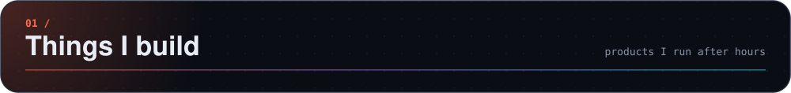
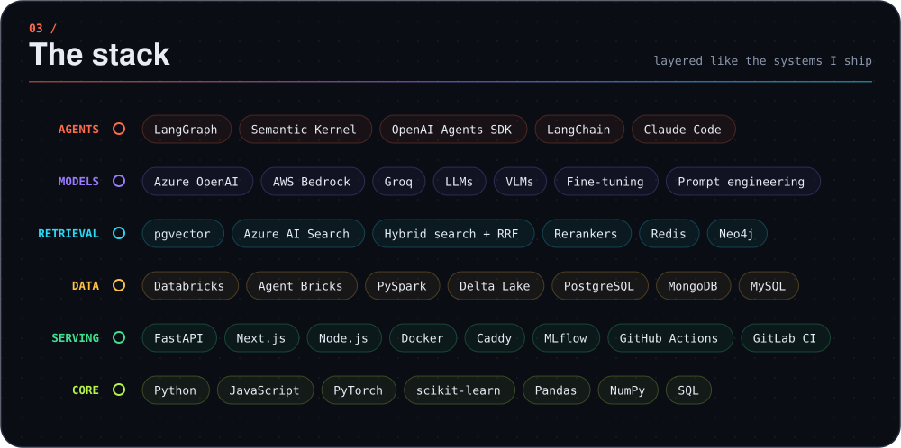
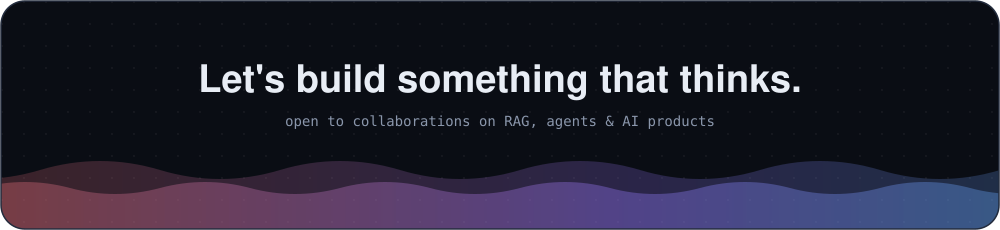

 

  

  

  

   

  

  

  

&nbsp;
&nbsp;
&nbsp;

  

<b>🎨 Earlier work: 3D web & ML experiments</b>

 

Before moving into GenAI I built interactive 3D websites with Three.js and React, plus some early ML projects: [portfolio](https://shaileshp1802.github.io/portfolio/), [3D product configurator](https://github.com/shaileshp1802/configurator), [FaceGAN](https://github.com/shaileshp1802/FaceGAN) and [drug name detection with Detectron2](https://github.com/shaileshp1802/drug_name_detection_detectron2).

